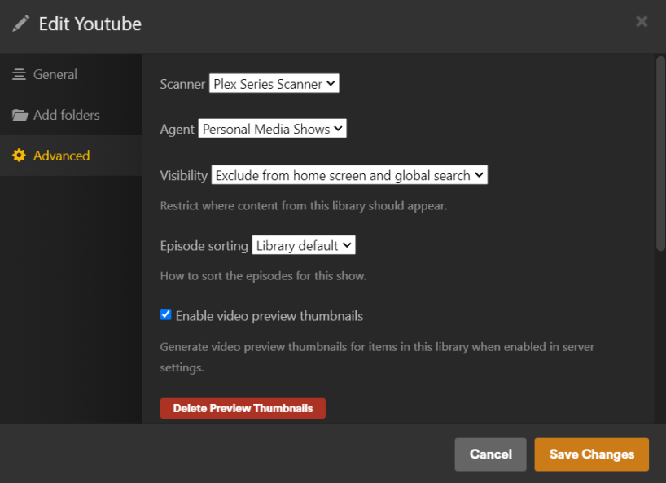
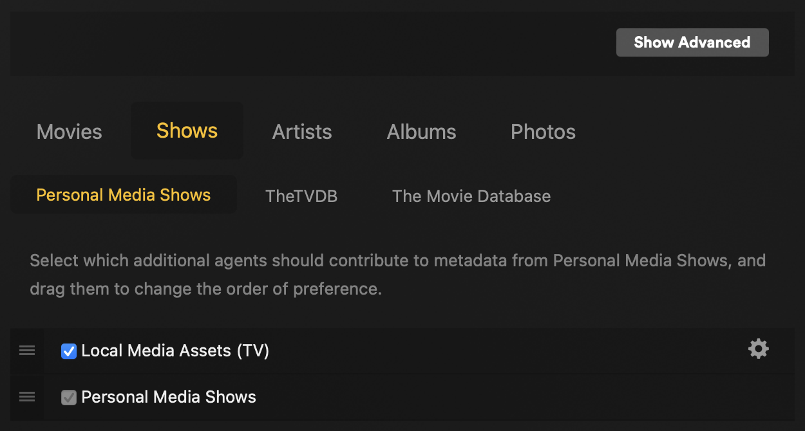

===
FAQ
===

Since ytdl-sub is relatively new to the public, there has not been many question asked yet. We will update this as more questions get asked.

.. contents:: Frequently Asked Questions
  :depth: 3

How do I...
-----------

...remove the date in the video title?
~~~~~~~~~~~~~~~~~~~~~~~~~~~~~~~~~~~~~~

The :ref:`config_reference/prebuilt_presets/tv_show:TV Show` presets by default include the upload date in the ``episode_title``
override variable. This variable is used to set the title in things like the video metadata, NFO file, etc, which is
subsequently read by media players. This can be overwritten as you see fit by redefining it:

.. code-block:: yaml

   overrides:
     episode_title: "{title}"  # Only sets the video title

...get support or reach out to contribute?
~~~~~~~~~~~~~~~~~~~~~~~~~~~~~~~~~~~~~~~~~~

If you need support, you can:

* :ytdl-sub-gh:`Open an issue on GitHub <issues/new>`

* `Join our Discord <https://discord.gg/v8j9RAHb4k>`_

If you would like to contribute, we're happy to accept any help, even non-coders! To find out how you can help this project, you can:

* `Join our Discord <https://discord.gg/v8j9RAHb4k>`_ and leave a comment in #development with where you think you can assist or what skills you would like to contribute.

* If you just want to fix one thing, you're welcome to :ytdl-sub-gh:`submit a pull request <compare>` with information on what issue you're resolving and it will be reviewed as soon as possible.

...download age-restricted YouTube videos?
~~~~~~~~~~~~~~~~~~~~~~~~~~~~~~~~~~~~~~~~~~

See `yt-dl's recommended way <https://github.com/ytdl-org/youtube-dl#how-do-i-pass-cookies-to-youtube-dl>`_ to download your YouTube cookie, then add it to your :ref:`ytdl options <config_reference/plugins:ytdl_options>` section of your config:

.. code-block:: yaml

  ytdl_options:
    cookiefile: "/path/to/cookies/file.txt"

...automate my downloads?
~~~~~~~~~~~~~~~~~~~~~~~~~

:doc:`This page </guides/getting_started/automating_downloads>` shows how to set up ``ytdl-sub`` to run automatically on various platforms.

...download large channels?
~~~~~~~~~~~~~~~~~~~~~~~~~~~

See the prebuilt preset :doc:`chunk_initial_download </prebuilt_presets/helpers>`.

...filter to include or exclude based on certain keywords?
~~~~~~~~~~~~~~~~~~~~~~~~~~~~~~~~~~~~~~~~~~~~~~~~~~~~~~~~~~

See the prebuilt preset :doc:`Filter Keywords </prebuilt_presets/helpers>`.

There is a bug where...
-----------------------

...date_range is not downloading older videos after I changed the range
~~~~~~~~~~~~~~~~~~~~~~~~~~~~~~~~~~~~~~~~~~~~~~~~~~~~~~~~~~~~~~~~~~~~~~~

Your preset most likely has ``break_on_existing`` set to True, which will stop downloading additional metadata/videos if the video exists in your download archive. Set the following in your config to skip downloading videos that exist instead of stopping altogether.

.. code-block:: yaml

  ytdl_options:
    break_on_existing: False

After you download your new date_range duration, re-enable ``break_on_existing`` to speed up successive downloads.

...it is downloading non-English title and description metadata
~~~~~~~~~~~~~~~~~~~~~~~~~~~~~~~~~~~~~~~~~~~~~~~~~~~~~~~~~~~~~~~

Most likely the video has a non-English language set to its 'native' language. You can tell yt-dlp to explicitly download English metadata using.

.. code-block:: yaml

  ytdl_options:
    extractor_args:
      youtube:
        lang:
          - "en"

...Plex is not showing my TV shows correctly
~~~~~~~~~~~~~~~~~~~~~~~~~~~~~~~~~~~~~~~~~~~~

1. Set the following for your ytdl-sub library that has been added to Plex.

- **Scanner:** Plex Series Scanner
- **Agent:** Personal Media shows
- **Visibility:** Exclude from home screen and global search
- **Episode sorting:** Library default
- **YES** Enable video preview thumbnails

2. Under **Settings** > **Agents**, confirm Plex Personal Media Shows/Movies scanner has **Local Media Assets** enabled.

